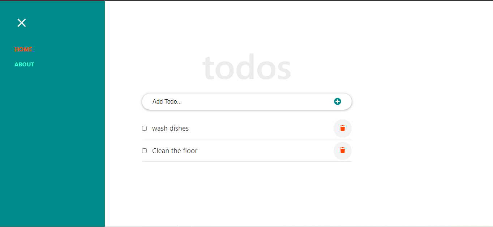

# React Todo App

This React to-do application was motivated by a React tutorial. I followed the tutorial judiciously to consolidate my skills in React library. The app can delete, update, and add new tasks to enhance task management.



## Built With

- React (A free and open-source front-end JavaScript library for building user interfaces based on UI components)

## Live Demo

[Live Demo Link](https://reactttodolist.netlify.app/)

### Prerequisites

The basic requirements for building the executable are:

- A working browser application (Google chrome, Mozilla Fire fox, Microsoft edge ...)
- Have a good knowledge on how to parse UI designs
- Have VSCode or other text editor installed. [Link to download VSCode](https://code.visualstudio.com/download)
- Install node package. [Link to download node](https://nodejs.org/en/download/)
- Have git installed.[Link to download git](https://git-scm.com/downloads)
- Create a github repository.

## Getting Started

To get a local copy up and running follow these simple example steps.

#### Cloning the project

```
git clone  https://github.com/usorfaitheloho/todolist-react.git <Your-Build-Directory>

```

```
cd <Your-Build-Directory>

```

## Getting packages and dependencies

To get all package modules required to build the project run:

```
npm install
```

every package module required to build the project is listed in the package.json file. this is used as a reference to get all dependencies.

## Running

To run the program on a browser through a server run this command in your cli

```
npm start
```

This should open the page in your localhost on port 3000. then you'd be able to view the built page generated using webpack.

## Run tests

### `npm test`

Launches the test runner in the interactive watch mode.\
See the section about [running tests](https://facebook.github.io/create-react-app/docs/running-tests) for more information.

## Building

### `npm run build`

Builds the app for production to the `build` folder.\
It correctly bundles React in production mode and optimizes the build for the best performance.

The build is minified and the filenames include the hashes.\
Your app is ready to be deployed!

See the section about [deployment](https://facebook.github.io/create-react-app/docs/deployment) for more information.

### `npm run eject`

**Note: this is a one-way operation. Once you `eject`, you can’t go back!**

If you aren’t satisfied with the build tool and configuration choices, you can `eject` at any time. This command will remove the single build dependency from your project.

Instead, it will copy all the configuration files and the transitive dependencies (webpack, Babel, ESLint, etc) right into your project so you have full control over them. All of the commands except `eject` will still work, but they will point to the copied scripts so you can tweak them. At this point you’re on your own.

You don’t have to ever use `eject`. The curated feature set is suitable for small and middle deployments, and you shouldn’t feel obligated to use this feature. However we understand that this tool wouldn’t be useful if you couldn’t customize it when you are ready for it.

## 🤝 Contributing

Feel free to check the [issues page](../../issues/).

👤 **Faith Usor**

- GitHub: [@githubhandle](https://github.com/usorfaitheloho)

- LinkedIn: [LinkedIn](https://www.linkedin.com/in/faith-usor16)

## Show your support

Give a ⭐️ if you like this project!

## Acknowledgments

- Microverse
